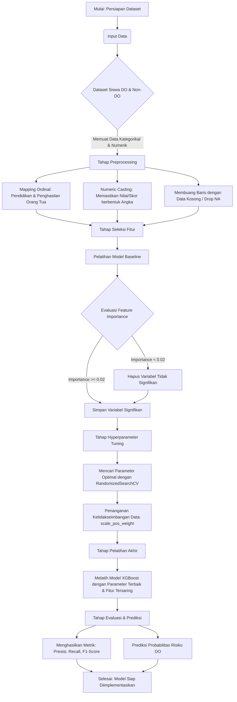

# Flowchart Pengerjaan Machine Learning (XGBoost)

Berikut adalah alur logika (flowchart) dari proses pelatihan model Machine Learning untuk deteksi dini risiko putus sekolah (Early Warning System) menggunakan algoritma XGBoost.

## Penjelasan Singkat
1. **Input Data**: Dataset yang memuat informasi demografi dan berbagai nilai/skor akademik.
2. **Preprocessing**: Memastikan tipe data sudah benar. Variabel kategorikal yang memiliki tingkatan (seperti tingkat pendidikan) diubah menjadi angka yang berurutan. Nilai/skor dipastikan bertipe numerik.
3. **Seleksi Fitur**: Melatih model awal secara kasar untuk melihat variabel apa saja yang sebenarnya berpengaruh. Variabel yang sumbangsihnya terlalu kecil (importance < 0.02) dieliminasi agar model lebih efisien.
4. **Tuning & Imbalance Handling**: Menggunakan teknik *RandomizedSearchCV* untuk mencari kombinasi *hyperparameter* terbaik dari XGBoost. Karena jumlah siswa DO biasanya jauh lebih sedikit (minoritas) dibandingkan siswa Non-DO, diterapkan pembobotan kelas (*scale_pos_weight*) agar model tidak bias.
5. **Pelatihan Akhir & Evaluasi**: Model final dilatih menggunakan parameter terbaik dan fitur yang sudah terseleksi, kemudian dievaluasi kinerjanya.
