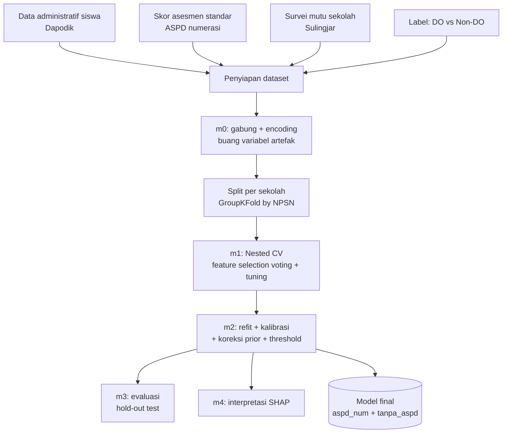
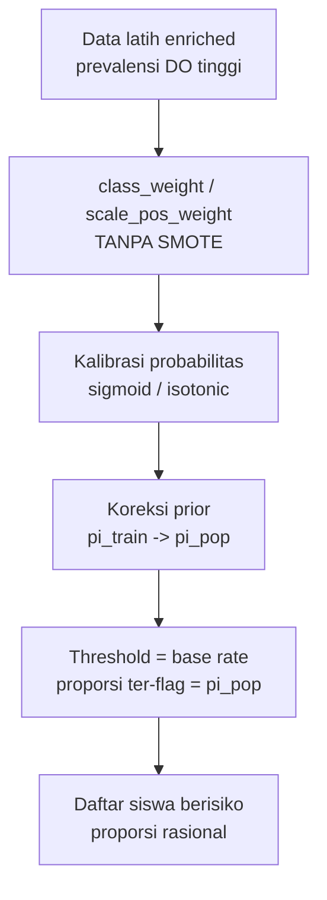
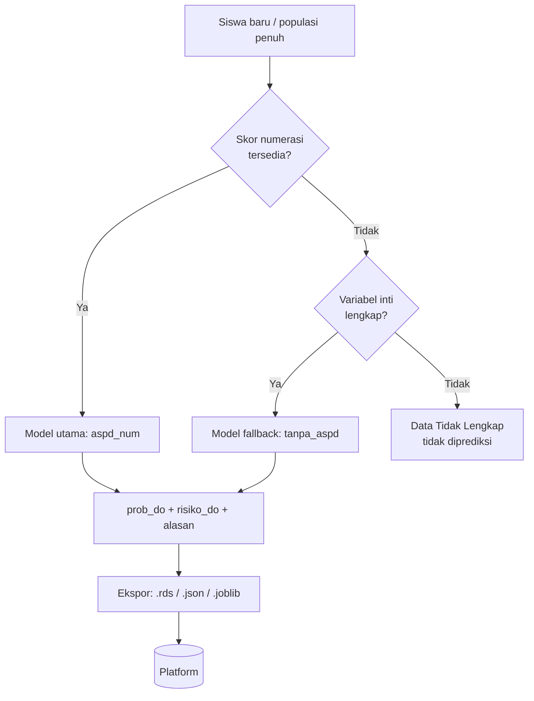

# Diagram Alir

## 1. Penyiapan data → model final

## 2. Pemilihan fitur (hybrid voting, di dalam fold CV)

```mermaid
flowchart LR
    X[Kandidat fitur] --> V1[Signifikansi<br/>regresi logistik p&lt;0.05]
    X --> V2[Random Forest<br/>importance &gt; median]
    X --> V3[SHAP XGBoost<br/>&#124;value&#124; &gt; median]
    V1 --> VOTE{Terpilih bila<br/>muncul di &ge;2 dari 3}
    V2 --> VOTE
    V3 --> VOTE
    VOTE --> SEL[Fitur terpilih]
```

## 3. Penanganan ketidakseimbangan & proporsi rasional

## 4. Implementasi tiered + ekspor platform

> Catatan: Sulingjar adalah variabel level sekolah, sehingga split & cross-validation
> dilakukan **per sekolah** (GroupKFold) untuk mencegah kebocoran data.
